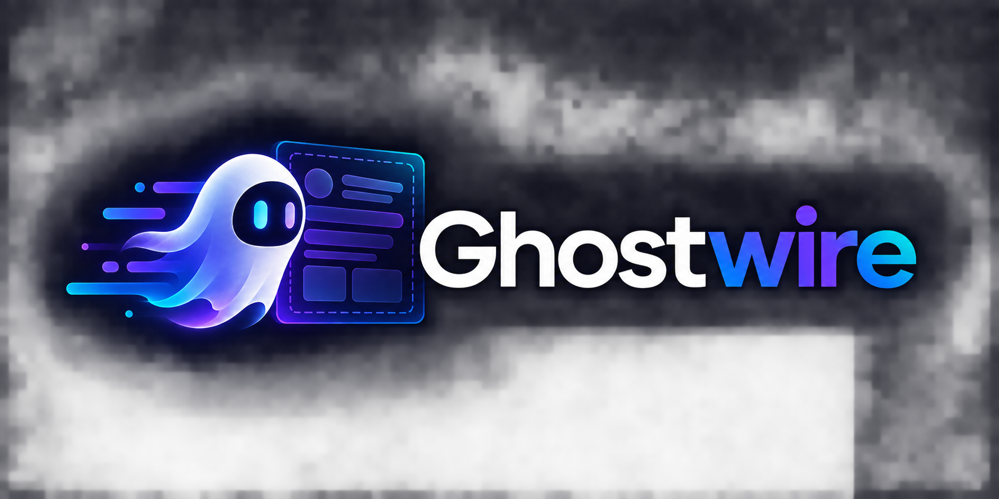

<p align="center">
  
</p>

<p align="center">
  <a href="https://packagist.org/packages/matheusmarnt/ghostwire"></a>
  <a href="https://github.com/matheusmarnt/ghostwire/actions?query=workflow%3Atests+branch%3Amain"></a>
  <a href="https://packagist.org/packages/matheusmarnt/ghostwire"></a>
  <a href="LICENSE.md"></a>
  <a href="https://laravel.com"></a>
  <a href="https://livewire.laravel.com"></a>
  <a href="https://matheusmarnt.github.io/ghostwire/"></a>
</p>

# Ghostwire

Automatic runtime skeleton loaders for Livewire — synthesized from your live DOM, zero markup.

> 📘 **Documentation**: <https://matheusmarnt.github.io/ghostwire/> · 🇧🇷 [Português](docs/readme-pt.md) · 🇪🇸 [Español](docs/readme-es.md)

Add `wire:ghost` to any element (or `#[Ghost]` to a component class, with zero view changes) and Ghostwire synthesizes a matching skeleton from the live DOM the instant a Livewire request starts — no hand-written placeholder markup, no layout shift, and it works identically whether your app runs Livewire 3.6+ or 4.x.

## Features

- **Zero-markup synthesis** — walks the live DOM, classifies text/heading/media/control/container nodes, and emits a matching Bone Tree, all in one batched read pass (no forced reflow)
- **Dual Livewire bridge** — Livewire 3.6+ and 4.x supported from the same package, selected by runtime feature detection (never a version-string check)
- **Morph-safe** — the Ghost Layer mounts outside Livewire's reconciled tree; concealment uses only `visibility`/`opacity`/`pointer-events`, never a structural DOM change
- **`freeze` mode** — dims and disables the live host in place, for layouts synthesis can't safely cover
- **`#[Ghost]` attribute** — class- or method-level, a 7-level precedence cascade (directive modifier → directive expression → method → class → inherited → config → package default), zero view changes required
- **Silence by default** — sync-only and polling messages never trigger a ghost, so background updates stay invisible
- **Repeat-sibling sampling, scrollable clipping, sticky/fixed geometry** — real layouts (paginated tables, kanban boards, scrollable panels) synthesize correctly, not just simple cards
- **Theming** — shimmer/pulse/wave animations, automatic dark mode, `prefers-reduced-motion` support, all pure CSS behind data/CSS-variable tokens
- **Accessibility** — `aria-busy`, focus preservation across the ghost window, a shared live region announcing loading/idle state; axe-core clean at the strictest level
- **CSP-safe** — runs under a strict Content-Security-Policy (no inline scripts, no `eval`); stylesheet nonce support built in
- **`php artisan ghost:inspect`** — see exactly which precedence level decided each component's configuration

## Requirements & compatibility

| | Supported |
|---|---|
| PHP | 8.2, 8.3, 8.4 |
| Laravel | 11.x, 12.x, 13.x |
| Livewire | 3.6+, 4.x |

### Tier matrix (FR-81)

Bridge selection is runtime feature detection, never a version string. Everything below is verified on both lines in CI.

| Tier | Capabilities |
|---|---|
| **A — identical** | Directive + every modifier except `.island` · `#[Ghost]` in full (class, method, inheritance, precedence) · synthesis · `freeze` · timing (delay/hold/timeout) · sync silence · theme & tokens · accessibility · morph coexistence |
| **B — degraded on 3.x** | Post-paint removal (emulated via double `requestAnimationFrame`) · finalization (composed from multiple hooks) · cancellation (resolved as finalization) · poll detection (origin heuristic) · per-action interception (bridge-level filter — same observable behavior) |
| **C — 4.x only** | Island scoping (`.island`) · message-skip handling |

Full detail: [`/docs/compat`](https://matheusmarnt.github.io/ghostwire/docs/compat/).

## Installation

```bash
composer require matheusmarnt/ghostwire
```

```blade
<div wire:ghost>
    {{-- your existing Livewire markup, unchanged --}}
</div>
```

See [`/docs/install`](https://matheusmarnt.github.io/ghostwire/docs/install/) for the full first-effect walkthrough, and [`/playground`](https://matheusmarnt.github.io/ghostwire/playground/) to try synthesis on your own markup without installing anything.

## Documentation

Full docs, live playground, and gallery: **<https://matheusmarnt.github.io/ghostwire/>**

- [`/docs/wire-ghost`](https://matheusmarnt.github.io/ghostwire/docs/wire-ghost/) — directive & modifiers
- [`/docs/ghost-attribute`](https://matheusmarnt.github.io/ghostwire/docs/ghost-attribute/) — `#[Ghost]` attribute & precedence
- [`/docs/choosing`](https://matheusmarnt.github.io/ghostwire/docs/choosing/) — directive vs. attribute
- [`/docs/compat`](https://matheusmarnt.github.io/ghostwire/docs/compat/) — Livewire 3/4 tier matrix
- [`/docs/theming`](https://matheusmarnt.github.io/ghostwire/docs/theming/) — tokens, dark mode, animation
- [`/docs/how-it-works`](https://matheusmarnt.github.io/ghostwire/docs/how-it-works/) — the synthesis algorithm
- [`/docs/security`](https://matheusmarnt.github.io/ghostwire/docs/security/) — CSP, transport, supply chain
- [`/docs/testing`](https://matheusmarnt.github.io/ghostwire/docs/testing/) — Pest helpers & browser tests
- [`/docs/interop`](https://matheusmarnt.github.io/ghostwire/docs/interop/) — `@placeholder`, Wirebones, Flux, livecharts, scoutify

## Security

See [`SECURITY.md`](SECURITY.md) and [`/docs/security`](https://matheusmarnt.github.io/ghostwire/docs/security/). No DOM data ever leaves the browser; learning is local-only; zero telemetry (FR-93).

## Other packages by the author

- [livecharts](https://github.com/matheusmarnt/livecharts)
- [scoutify](https://github.com/matheusmarnt/scoutify)
- [scoutify-mcp](https://github.com/matheusmarnt/scoutify-mcp)

## License

MIT © [Matheus Mariano](https://github.com/matheusmarnt). See [LICENSE.md](LICENSE.md).
